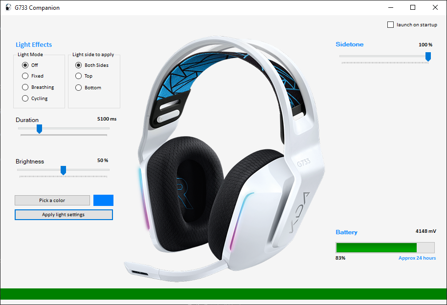

# G733 Companion

[Introduction](#introduction)  
[Instruction](#instruction)  
[How to use "Basic" logitech drivers](#how-to-use-basic-logitech-drivers)  
[Acknowledgements](#acknowledgements)

## Introduction

#### Why ???

TL;DR: Because Logitech G HUB is a piece of trash and I needed to get away from it. It's buggy and it sure feels like they never fix any of their bugs.

You can read the original rant by YulCmr on what drove him to make it. And this is my version.

Long rant time.

I was super close to just returning this G733 headset. I bought the K/DA variant as it happened to be the only one on sale among the G733s. And since the day I bought it, it has been pain. The hardware is good, it's comfy, it's light weight, and it seems to have pretty good hardware (mic excluded). But it's all ruined by G HUB...

G733 no longer come with Dolby, even though older models did, as the licensing with Logitech seem to have ended. So you are left with only DTS spatial sound, or plain stereo speakers. But you likely aren't buying high-end headset to just have stereo. But it's not just lack of Dolby being an option, G HUB goes out of its way to prevent you from using anything but G HUB to control your spatial sound. It actively disables you from changing it from windows sound settings. That's not great... but it wouldn't be so bad if DTS on G HUB sounded like absolute garbage. Various forums such as Reddit seem to be littered with people complaining about it sounding like they're trapped inside a tin can. I figured DTS can't possibly sound this bad... So I did a bit of manual tweaking, managed to enable DTS from windows and disabling from G HUB. And voila! Sounds great! I tried uninstalling G HUB and enabling either Dolby or DTS from windows as well. Again, it's great. So it turned out it's just G HUB being terrible, it wasn't DTS's fault at all. I still prefer Dolby, and stumbled across YulCmr's version which led me here.

My nightmares with G HUB didn't end there however. I have Logitech's G600 MMO Mouse (gen 1). I like to have ton of profiles for all kinds of applications. I used to use Logitech Gaming Software (LGS) with it. While it wasn't perfect, it worked fine. Everything worked as it should. Then enter... G HUB.

G HUB frankly does not work with my G600. It has so many bugs, it's amazing that they have chosen to scrap LGS in favor of this for this mouse. For example, I like my back/forward buttons on the side so I can press with my thumbs. This is not the default assignment on G600. So out of the many thumb keys, I assigned them to back and forward. I click. Nothing. Tried assigning middle click to one of those buttons. Nothing. Other keyboard key assignments work fine... So, more work around time. I created a sequence macro where if a button is pressed, it simulates a middle click. And it worked! Great, I figured it's annoying, but as long as I can assign everything with macros, I can still use it. I'm sure you can see where this story goes. None of the macros work in certain software like VMWare. Despite the fact that G HUB shouldn't care at all what program I'm running, if I swap to vmware instance, macros stop working for no reason. Even if the macros are set to persistent. Searching online only got me numerous reports of other people having the exact same problems going back as far as 4 years--essentially launch of G HUB. So, figured Logitech is never going to fix any of this. Multi-profile functionality of my mouse is something I have gotten very used to and not something I want to let go.

Well... so my choices were: 
- Get a new non-logitech mouse and use G733 with GHUB or
- use G733 without GHUB, sticking to only the driver and use G600 with LGS.

I initially thought of picking the latter. But... G733's stupid forward facing RGB is distracting. I don't wear glasses and I can still see them. Can't imagine how terrible it would be for people with glasses as it reflects off of them. Now I **had** to turn off RGB but can't do it without GHUB! Go back to GHUB? It's like trying to pick lesser evil.

Circled my way back to YulCmr's amazingly reverse engineered brilliance. And here we are. I haven't ran across any bugs, so had nothing to fix. Just beautified it a little bit. So all the features are as-is. Only visuals, such as the interface and icons have been changed.

So, this is my solution to my problem of having to deal with G HUB. I will never buy any more Logitech stuff that uses G HUB ever again. 

## Instruction

You can download the release [here](https://github.com/grumpyland/G733_Companion/releases)

Just extract the contents of the 7z archive. There's only two files. And run the exe.

This software does not provide Dolby Atmos by itself. [You'll have to install that from windows store (not free) if you choose to do so](https://apps.microsoft.com/store/detail/dolby-access/9N0866FS04W8). [If you want to use DTS, it is also available from windows store](https://apps.microsoft.com/store/detail/dts-sound-unbound/9PJ0NKL8MCSJ). Though it's paid software normally, it will detect your G733 automatically and license it for free. You can now use windows feature of right clicking sound in tray, spatial sound and selecting any of the flavor you want. I suppose even Windows Sonic is an option.

The app should be fairly self-explanatory. Sidetone is the mic volume.

## How to use "Basic" logitech drivers

**Note:** I did not have to go to use basic driver. But I have kept this portion of the instruction from the original as it may or may not be required for some individuals. 

1. Open your Device Manager
2. Right click -> Update Driver, on the logitech G733 device in the "Sound, video and game controllers" section, NOT the "Audio inputs and outputs"  

3. Click "Browse my computer for drivers"  
  
4. Click "Let me pick from a list of available drivers on my computer"  
  
5. Choose "USB Audio Device" instead of the Logitech one
  
6. Restart your computer (That's actually important)

Once you have installed and enabled Dolby Atmos, you may still have NO sound. Do this again WITHOUT restarting, you should be good.

## Acknowledgements

99.99% of the credit goes to YulCmr's original.
